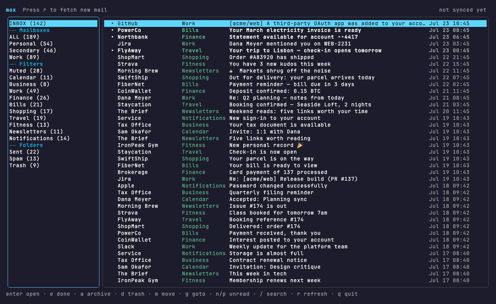
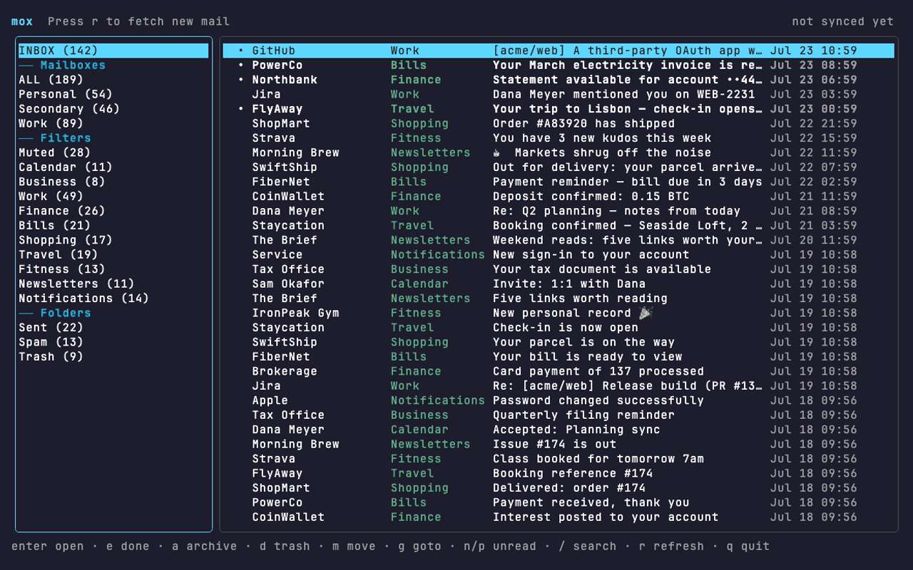
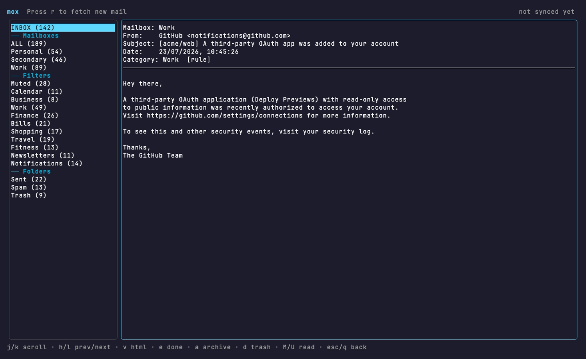
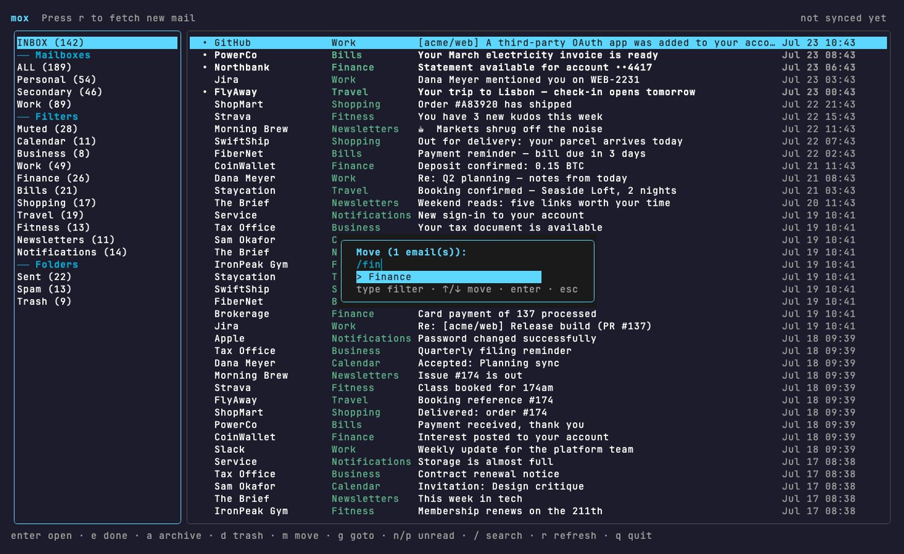
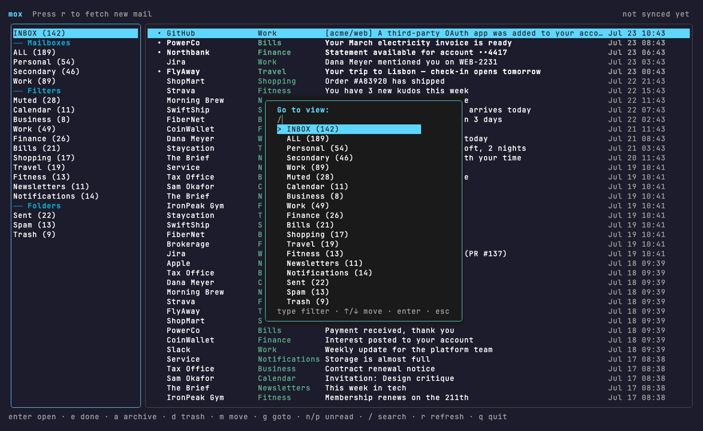
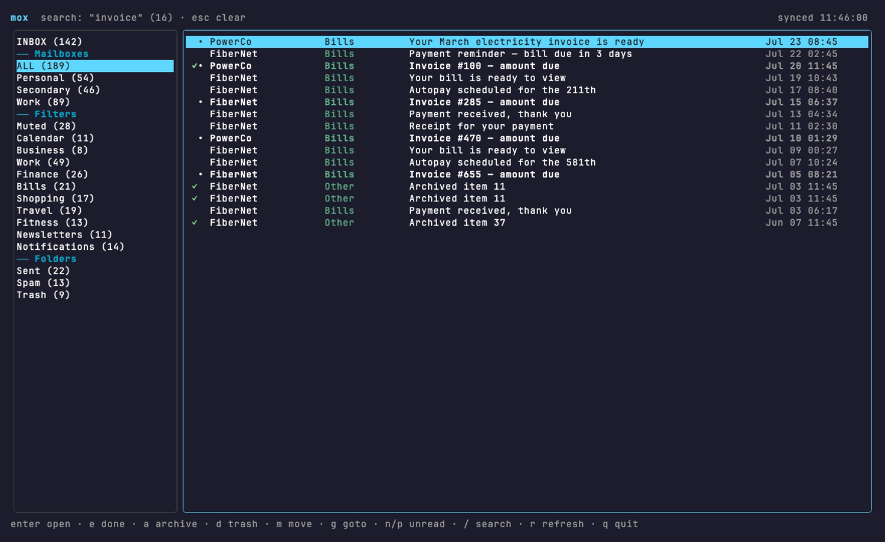

<div align="center">

# 📬 mox

**A fast terminal email client that files your inbox by category — locally, deterministically, with no AI and no API keys.**

*Spark-style categories, neomutt speed, one SQLite file on your Mac.*

<br>



<br>



*`g` jumps between views · `e` marks an email done (it leaves the inbox) · `u` restores it — all keyboard, all local.*

</div>

---

## Why this exists

Three honest reasons:

1. **My inbox is a firehose, and folders never kept up.** Spark's categorized inbox was the one feature I actually missed in the terminal. mox files every message into **Work / Finance / Bills / Travel / …** the instant it arrives, so the important few float up and the noise collects itself into buckets I can clear in one keystroke.
2. **I didn't want a model in the loop.** Categorization here is **rule-based and instant** — sender domain, exact address, or a word in the subject. No LLM call, no latency, no key to leak, no "why did it file this here?" mystery. The rules are a YAML file I can read.
3. **My mail should live on my machine.** mox syncs IMAP into **one SQLite file** under `~/Documents/mox`. Categories and the "done" state exist only there — mox never creates a label or folder on your server. The only server writes are the triage actions you explicitly press (read/unread, archive, trash), each with an undo.

<div align="center">


*Open anything with `enter`. `v` opens the full HTML in your browser; `D` saves attachments.*
</div>

---

## What it does

| | |
|---|---|
| 🗂 **Category sidebar** | Every message is filed into a category on arrival. The sidebar shows **INBOX** (active mail only), **Mailboxes** (ALL + per-account), your **Filters** (categories), and server **Folders** (Sent / Spam / Archived / Trash) — each with a live count. |
| ⚡ **Rule-based, instant** | Filing is deterministic: the first category whose `match` claims a message wins (`domains`, `addresses`, or subject/sender `words`). No AI, no API key, no network round-trip. Order in the config *is* precedence. |
| 🔒 **Local by construction** | Categories and the local-only **done** state live only in your SQLite DB. mox never writes labels/folders to the server. Delete `~/Documents/mox` and it never happened. |
| 🧹 **One-key triage** | `e` done · `a` archive · `d` trash — each with an inverse (`u`). Multi-select with `space`, then act on the whole batch. Read/unread (`M`/`U`) sync to the server; done is local. |
| 🔀 **Type-to-filter move** | `m` opens a fuzzy picker over every category — type a few letters, `enter`, done. Same picker powers `g` **goto** for jumping between views. |
| 🔎 **Live search** | `/` filters the current view as you type, with operators (`from:`, `subject:`, `is:unread`). `n`/`p` jump between unread. |
| 📎 **Attachments on demand** | Bodies are cached locally (retention is configurable); attachment *files* are fetched only when you press `D` — single file or a per-email subfolder. |
| 🤖 **MCP for Claude** | A read-only MCP server exposes `search` / `get` / `list` / `stats` over your mail, so Claude Code can sort the leftovers or answer "what did the bank send last week?" without touching your server. |

<div align="center">
 

*`m` move · `g` goto — the same type-to-filter picker, everywhere.*
</div>

---

## Install

### macOS (prebuilt binary)

```bash
curl -fsSL https://raw.githubusercontent.com/iliutaadrian/mox/main/install.sh | bash
```

Installs the right binary for your chip (Apple Silicon / Intel) to `~/.local/bin/mox`. No Bun, no `node_modules`, nothing else to install. Set `MOX_INSTALL_DIR` to change the location.

Prefer to do it by hand? Grab `mox-darwin-arm64` (or `-x64`) from the [latest release](https://github.com/iliutaadrian/mox/releases/latest), `chmod +x`, and drop it on your `PATH`.

### Run from source (dev)

Requires [Bun](https://bun.sh). `open` (built in) launches HTML/links in a browser.

```bash
bun install
./mox                       # launcher → bun src/index.tsx (uses ./config.yaml)
```

Build a standalone binary yourself:

```bash
bun run build               # → dist/mox (self-contained)
bun run install-bin         # build + install to ~/.local/bin/mox
```

---

## Configure

The installed binary keeps everything in one folder: **`~/Documents/mox`** (config, database, downloaded attachments).

```bash
mkdir -p ~/Documents/mox
cp config.example.yaml ~/Documents/mox/config.yaml
$EDITOR ~/Documents/mox/config.yaml
```

Running from source uses `./config.yaml` at the repo root instead. Lookup order: `$MOX_CONFIG` → `./config.yaml` (dev) → `~/Documents/mox/config.yaml`. The SQLite store sits beside it (`$MOX_DB` overrides). For Gmail/Yahoo, use an **App Password**, not your account password.

Categories are matched top-to-bottom; the first `match` that claims a message wins, so **order is precedence**:

```yaml
- name: Work
  match:
    domains:   [company.com]              # sender domain (also matches subdomains)
    addresses: [alerts@honeybadger.io]    # exact sender address
    words:     [invoice, standup]         # case-insensitive substring of SUBJECT or SENDER NAME
```

A category without a `match` is a manual-only bucket (the `m` picker still moves mail into it). `inbox_exclude: [Muted]` keeps noisy categories out of INBOX and ALL while leaving them reachable from their own sidebar entry.

---

## Keys

<div align="center">


*`/` searches the active view live — here `invoice` across ALL mail.*
</div>

**List view**

| Key | Action |
| --- | --- |
| `enter` | Open the highlighted email |
| `j`/`k` (↑↓) | Move cursor / scroll |
| `tab` / `h` `l` | Switch focus between sidebar and list |
| `space` | Select / deselect (multi-select) |
| `e` | **Done** — hide from INBOX (local only) |
| `a` / `d` | **Archive** / **Trash** on the server |
| `u` | **Restore** — undone / unarchive / untrash |
| `m` | Move the selection to a category |
| `g` | **Goto** — jump to any view |
| `M` / `U` | Mark read / unread **on the server** |
| `n` / `p` | Next / previous unread |
| `/` | Search (`from:` `subject:` `is:unread` …) |
| `r` | Fetch new mail + reconcile Trash/Archive |
| `esc` / `q` | Clear selection·search / quit |

**Reading view**

| Key | Action |
| --- | --- |
| `j` / `k` | Scroll the email |
| `h` / `l` | Previous / next email |
| `v` | Open the full HTML email in the browser |
| `D` | Download attachments (subfolder if multiple) |
| `e`/`a`/`d` | Done / archive / trash |
| `u` | Restore (in Trash / Archive / done) |
| `M` / `U` | Mark read / unread on the server |
| `esc` / `q` | Back to the list |

---

## Refresh & headless

`r` refreshes **INBOX** over pooled, pre-warmed IMAP connections and reconciles **Trash/Archive** (drops local rows removed on the server). Deeper syncs run headless:

```bash
bun src/cli.ts sync                 # fetch ALL folders + rule-file, then exit
bun src/cli.ts attach <id> [name]   # download an attachment on demand
```

---

## Claude / MCP

mox ships a **read-only** MCP server (`search` / `get` / `list` / `stats`) so Claude Code can query your mail as first-class tools. Register it once:

```bash
claude mcp add mox -- bun /ABSOLUTE/PATH/mox/src/mcp.ts
```

It reads the same config/DB as the TUI and never writes to your mailbox.

---

## How it works

```
IMAP ──▶ local SQLite (body + html + local category/done columns)
              │
              ▼
     config rules file each INBOX message   (first match wins)
              │
              ▼
     OpenTUI/Solid TUI groups the inbox by category
```

| File | Role |
| --- | --- |
| `src/config.ts` | YAML config: accounts, categories, `match` rules |
| `src/paths.ts` | Where config + the SQLite store live (dev vs installed) |
| `src/db.ts` | `bun:sqlite` store; category/done are local-only columns |
| `src/mail.ts` | `imapflow` fetch + `mailparser`; pooled connections; server moves |
| `src/engine.ts` | fetch → rule-file → persist |
| `src/backend.ts` | in-process actions (sync/mark/move/archive/trash + inverses) |
| `src/app.tsx` | OpenTUI/Solid interface |
| `src/cli.ts` | headless entry (`sync`, `attach`) |
| `src/mcp.ts` | read-only MCP server for Claude |

Built with [OpenTUI](https://github.com/anomalyco/opentui) + [Solid](https://www.solidjs.com) on [Bun](https://bun.sh).

<sub>Screenshots are rendered from a **fictional** demo mailbox — regenerate with `bun docs/demo/seed.ts` and `vhs docs/tapes/<view>.tape`.</sub>

## License

[MIT](LICENSE)
