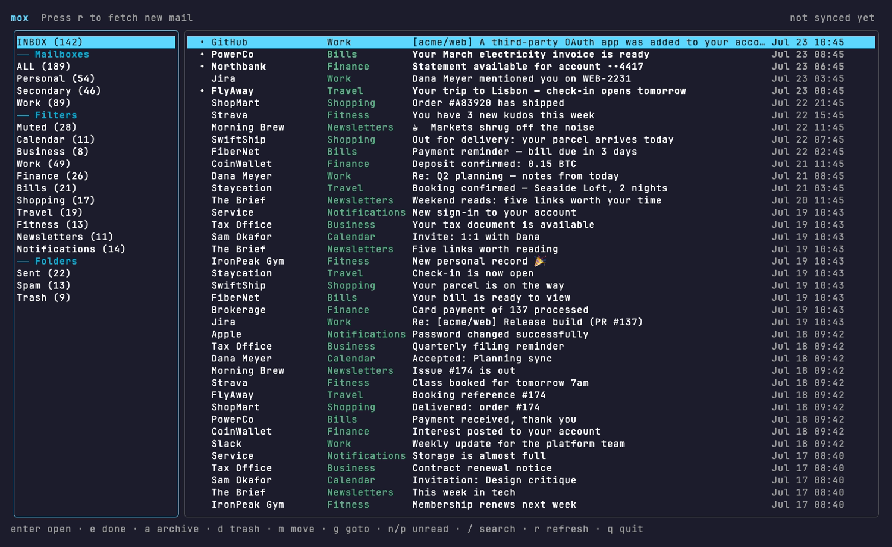
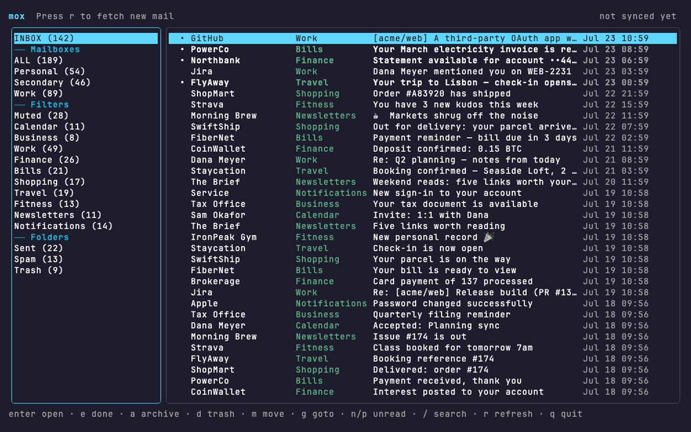
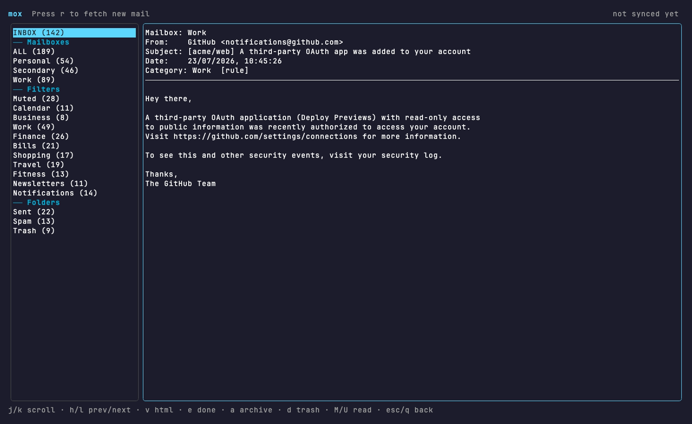
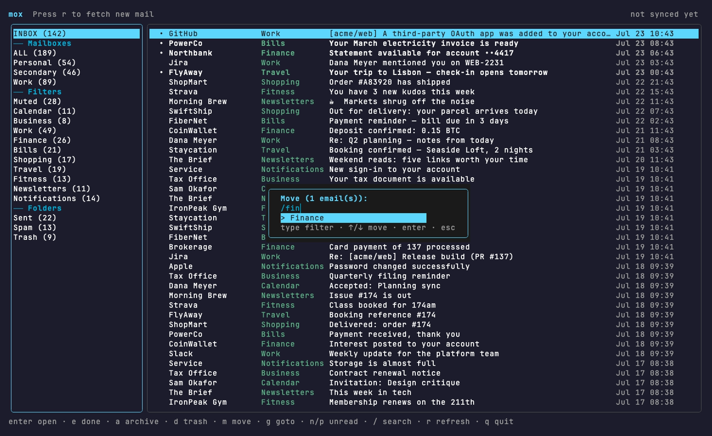
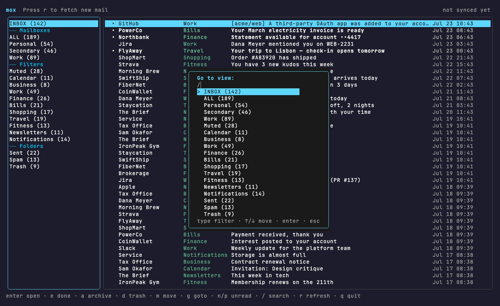
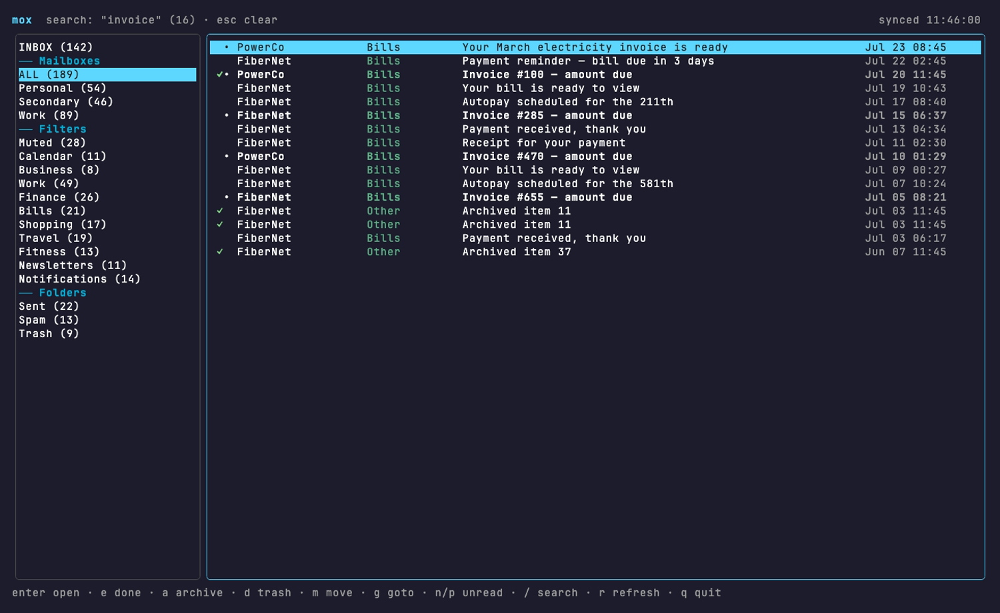
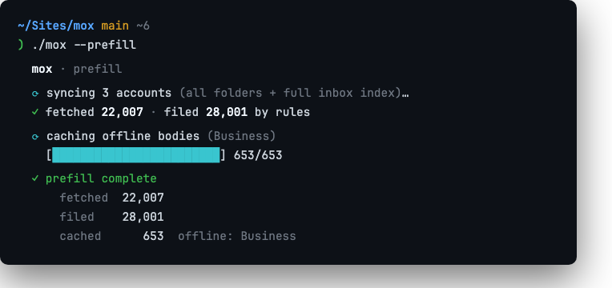

<div align="center">

# 📬 mox

**A fast terminal email client that files your inbox by category — locally, deterministically, with no AI and no API keys.**

*Spark-style categories, neomutt speed, one SQLite file on your Mac.*

<br>



<br>



*`g` jumps between views · `e` marks an email done (it leaves the inbox) · `z` restores it — all keyboard, all local.*

</div>

---

## Why this exists

Three honest reasons:

1. **My inbox is a firehose, and folders never kept up.** Spark's categorized inbox was the one feature I actually missed in the terminal. mox files every message into **Work / Finance / Bills / Travel / …** the instant it arrives, so the important few float up and the noise collects itself into buckets I can clear in one keystroke.
2. **I didn't want a model in the loop.** Categorization here is **rule-based and instant** — sender domain, exact address, or a word in the subject. No LLM call, no latency, no key to leak, no "why did it file this here?" mystery. The rules are a YAML file I can read.
3. **My mail should live on my machine.** mox syncs IMAP into **one SQLite file** under `~/Documents/mox`. Categories and the "done" state exist only there — mox never creates a label or folder on your server. The only server writes are the triage actions you explicitly press (read/unread, archive, trash), each with an undo.

<div align="center">


*Open anything with `enter`. `v` opens the full HTML in your browser; `s` downloads attachments.*
</div>

---

## What it does

| | |
|---|---|
| 🗂 **Category sidebar** | New mail is filed into a category on fetch. The sidebar shows **INBOX** (active mail only), **Mailboxes** (ALL + per-account), your **Filters** (categories), and server **Folders** (Sent / Spam / Archived / Trash) — each with a live count. |
| ⚡ **Rule-based, instant** | Filing is deterministic: the first category whose `match` claims a message wins (`domains`, `addresses`, or subject/sender `words`). No AI, no API key, no network round-trip. Order in the config *is* precedence. Edit the rules and run `mox --reclassify` to re-file existing mail — adds re-file, removals fall back to Uncategorized. |
| 🔒 **Local by construction** | Categories and the local-only **done** state live only in your SQLite DB. mox never writes labels/folders to the server. Delete `~/Documents/mox` and it never happened. |
| 💾 **Backed up on a schedule** | Because that database is the only copy of your categories and done state, mox snapshots it to `backup/` every 12 hours (configurable, keeps the last 2) using SQLite's `VACUUM INTO`. |
| 🧹 **One-key triage** | `e` done · `a` archive · `t` trash — each with an inverse (`z`). Multi-select with `space`, then act on the whole batch. Read/unread (`M`/`U`) sync to the server; done is local. |
| 🔀 **Type-to-filter move** | `m` opens a fuzzy picker over every category — type a few letters, `enter`, done. Same picker powers `g` **goto** for jumping between views. |
| 🔎 **Live search** | `/` filters the current view as you type, with operators (`from:`, `subject:`, `is:unread`). `n`/`p` jump between unread. |
| 📎 **Attachments on demand** | Bodies are cached locally (retention is configurable); attachment *files* are fetched only when you press `s` — saved under `Attachments/` next to the database (single file, or a per-email subfolder). |
| 🤖 **MCP for Claude** | An MCP server lets Claude Code read *and triage* your mail: get the inbox, search, mark done, trash/archive, re-file a whole sender into a category, download attachments, and draft replies for you to send. Local-only actions stay local; server moves are labelled as such. |

<div align="center">
 

*`m` move · `g` goto — the same type-to-filter picker, everywhere.*
</div>

---

## Install

### macOS (prebuilt binary)

```bash
curl -fsSL https://raw.githubusercontent.com/iliutaadrian/mox/main/install.sh | bash
```

Installs the Apple Silicon binary to `~/.local/bin/mox`. No Bun, no `node_modules`, nothing else to install. Set `MOX_INSTALL_DIR` to change the location.

Prefer to do it by hand? Grab `mox-darwin-arm64` from the [latest release](https://github.com/iliutaadrian/mox/releases/latest), `chmod +x`, and drop it on your `PATH`. **Intel Macs:** no prebuilt binary yet — [run from source](#run-from-source-dev).

### Run from source (dev)

Requires [Bun](https://bun.sh). `open` (built in) launches HTML/links in a browser.

```bash
bun install
./mox                       # launcher → bun src/index.tsx (uses ./config.yaml)
```

Build a standalone binary yourself:

```bash
bun run build               # → dist/mox (self-contained)
bun run install-bin         # build + install to ~/.local/bin/mox
```

---

## Configure

The installed binary keeps everything in one folder: **`~/Documents/mox`** (config, database, downloaded attachments).

```bash
mkdir -p ~/Documents/mox
cp config.example.yaml ~/Documents/mox/config.yaml
$EDITOR ~/Documents/mox/config.yaml
```

Running from source uses `./config.yaml` at the repo root instead. Lookup order: `$MOX_CONFIG` → `./config.yaml` (dev) → `~/Documents/mox/config.yaml`. The SQLite store sits beside it (`$MOX_DB` overrides). For Gmail/Yahoo, use an **App Password**, not your account password.

### Backups

Your categories, the local-only **done** flag and snooze times exist *only* in that SQLite file - they are never mirrored to the mail server, so a lost database cannot be re-synced. mox therefore snapshots it into a `backup/` folder next to the database (`~/Documents/mox/backup/` installed, the repo root in dev):

```yaml
backup_enabled: true      # off only if you write exactly `false`
backup_every_hours: 12    # a snapshot is taken when the newest one is older than this
backup_keep: 2            # older snapshots are pruned
```

A snapshot is taken at startup when one is due, and re-checked hourly so a session left open for days keeps snapshotting. Every command that can write takes one first - the interface, `mox mcp`, `mox --reclassify` and `mox --prefill`. The read-only `mox --stats` does not. Snapshots are written with SQLite's `VACUUM INTO`, not by copying files - the store runs in WAL mode, where a plain copy can silently miss recent writes. A failed backup (full disk, unwritable folder) is reported and then ignored; it never stops mox from opening.

Categories are matched top-to-bottom; the first `match` that claims a message wins, so **order is precedence**:

```yaml
- name: Work
  match:
    domains:   [company.com]              # sender domain (also matches subdomains)
    addresses: [alerts@honeybadger.io]    # exact sender address
    words:     [invoice, standup]         # case-insensitive substring of SUBJECT or SENDER NAME
```

A category without a `match` is a manual-only bucket (the `m` picker still moves mail into it). `inbox_exclude: [Muted]` keeps noisy categories out of INBOX and ALL while leaving them reachable from their own sidebar entry.

---

## Keys

<div align="center">


*`/` searches the active view live — here `invoice` across ALL mail.*
</div>

**List view**

| Key | Action |
| --- | --- |
| `enter` | Open the highlighted email |
| `j`/`k` (↑↓) | Move cursor / scroll |
| `d` / `u` | Half-page down / up (whichever pane has focus) |
| `tab` / `h` `l` | Switch focus between sidebar and list |
| `space` | Select / deselect (multi-select) |
| `e` | **Done** — hide from INBOX (local only) |
| `a` / `t` | **Archive** / **Trash** on the server |
| `z` | **Restore** — undone / unarchive / untrash |
| `m` | Move the selection to a category |
| `y` | **Copy** — then `i` id, `f` sender address, `s` subject, `a` row (works on the whole multi-selection) |
| `g` | **Goto** — jump to any view |
| `M` / `U` | Mark read / unread **on the server** |
| `n` / `p` | Next / previous unread |
| `/` | Search (`from:` `subject:` `is:unread` …) |
| `r` | Fetch new mail + reconcile Trash/Archive |
| `esc` / `q` | Clear selection·search / quit |

**Reading view**

| Key | Action |
| --- | --- |
| `j` / `k` | Scroll the email |
| `d` / `u` | Half-page down / up |
| `g` / `G` | Jump to the start / end of the email |
| `h` / `l` | Previous / next email |
| `v` | Open the full HTML email in the browser |
| `o` | Open a link: filterable picker over the `[N]` references in the body |
| `y` | **Copy mode** — `h`/`j`/`k`/`l` move a character cursor (`0`/`$` line ends, `g`/`G` email ends), `y` copies the cursor's line, `v` starts a selection that `y` then copies; or `i` id, `f` sender, `s` subject, `a` the whole email |
| drag | Select text with the mouse — releasing copies the selection |
| `s` | Download attachments to `Attachments/` next to the database (subfolder if multiple) |
| `e`/`a`/`t` | Done / archive / trash |
| `z` | Restore (in Trash / Archive / done) |
| `M` / `U` | Mark read / unread on the server |
| `esc` / `q` | Back to the list |

---

## Refresh & headless

`r` refreshes **INBOX + Sent** over pooled, pre-warmed IMAP connections and reconciles **Trash/Archive** (drops local rows removed on the server). Deeper syncs run headless:

```bash
mox --version                       # print the installed version
mox upgrade                         # download + install the latest release in place
mox --prefill                       # one-time seed: metadata for the WHOLE inbox
                                    #   + full bodies for offline_categories, then exit
mox --reclassify                    # re-file the whole inbox against the current
                                    #   config rules (manual moves kept), then exit
mox --stats                         # print a snapshot of downloaded/offline mail
```

Everything above runs on the installed binary. There is no separate CLI to keep in sync: the TUI covers day-to-day work, and anything scripted goes through the MCP tools.

### Drafts (compose without sending)

mox has **no SMTP on purpose**: the `create_draft` MCP tool composes a nicely formatted message (plain text + generated HTML, UTF-8 safe) and appends it to the account's **IMAP Drafts folder**. You review and hit Send from your provider's own UI (webmail / phone app), so nothing ever leaves the machine unseen.

Ask Claude to reply to a message and it reaches for that tool. A reply derives the account, the To address and the `Re: …` subject from the original, and threads it with In-Reply-To/References. A standalone draft needs an account, a recipient and a subject.

A draft can carry files. Pass `attachments` a list of **paths** to files already on disk (absolute, or starting with `~/`) and mox reads the bytes itself. You never paste file contents into the conversation, so attaching a 44 KB PDF costs a few tokens instead of tens of thousands. A relative path is refused, because it would resolve against whatever directory Claude Code started the server in. A path mox cannot read fails the whole draft, so a mail is never appended without its file.

A normal launch only pulls the most recent `fetch_limit` messages with full content. `mox --prefill` additionally sweeps **envelope-only metadata** over every older INBOX message (so the whole inbox is searchable offline; bodies fetch on demand when opened), and caches full bodies for the `offline_categories`.

Attachment presence is captured from IMAP **`BODYSTRUCTURE`** (no bytes downloaded) on every sync, so the list marks messages that carry files with a 📎. Files themselves are still fetched only on demand with `s`.

<p align="center"></p>

### Updating

mox has no auto-update — the binary never phones home. To update, either run `mox upgrade`, or re-run the installer (both overwrite the binary in place; your data in `~/Documents/mox/` is untouched):

```bash
curl -fsSL https://raw.githubusercontent.com/iliutaadrian/mox/main/install.sh | bash
```

---

## Claude / MCP

mox ships an MCP server so Claude Code can read *and triage* your mail as first-class tools. Register it once:

```bash
claude mcp add -s user mox -- mox mcp          # installed binary
claude mcp add -s user mox -- bun /ABSOLUTE/PATH/mox/src/mcp.ts   # from source
```

`-s user` registers the server for every session; the default scope covers only the current project. It reads the same config and database as the TUI, so a `space`-marked row in the interface and an id handed to a tool mean the same message.

Bare `mox mcp` only works if `mox` is on the `PATH` of the process that spawns MCP servers. `install.sh` puts the binary in `~/.local/bin`, which a GUI-launched Claude Code often does not inherit — the server then dies with `ENOENT` and the tools never show up. If that happens, register the absolute path instead (`claude mcp add -s user mox -- /Users/you/.local/bin/mox mcp`).

| Tool | What it does |
| --- | --- |
| `get_inbox` | The active, not-yet-triaged mail (respects `inbox_exclude`), newest first. `unread_only` optional. |
| `search_emails` | Full-text search with the same operators as `/` in the TUI. |
| `get_email` | Full headers, body and HTML for one id. |
| `triage_emails` | `done`/`undone`, `trash`/`untrash`, `archive`/`unarchive`, `read`/`unread` for one or many ids. |
| `set_category` | Re-file mail by ids, or **everything from one sender** (`from: "contact@oxigentour.ro"`). |
| `create_draft` | Compose a reply as a draft. This is the tool for "respond to this email". `attachments` takes paths to files on disk. |
| `download_attachments` | Fetch one email's files to `Attachments/` next to the database. |

**What actually changes where:** `done` and `set_category` are **local only** - they never touch your mail server, which is why they are safe to hand to a model. `trash`, `archive` and `read`/`unread` are **real IMAP moves**, visible in every other client. `create_draft` only appends to your Drafts folder; mox never sends, so you always review and send yourself. It **reads** any file you list in `attachments`, and nothing else on disk.

`set_category` matches a sender as an exact address (not a domain), records the change as your own choice so a later `mox --reclassify` cannot undo it, and only accepts categories that exist in your config or approved list. `download_attachments` saves next to your database - `~/Documents/mox/Attachments` for an installed mox, the repo root in a dev checkout - never into the project you happen to be chatting about, whatever directory Claude Code spawned the server in.

---

## How it works

```
IMAP ──▶ local SQLite (body + html + local category/done columns)
              │
              ▼
     config rules file each INBOX message   (first match wins)
              │
              ▼
     OpenTUI/Solid TUI groups the inbox by category
```

| File | Role |
| --- | --- |
| `src/config.ts` | YAML config: accounts, categories, `match` rules |
| `src/paths.ts` | Where config + the SQLite store live (dev vs installed) |
| `src/db.ts` | `bun:sqlite` store; category/done are local-only columns |
| `src/mail.ts` | `imapflow` fetch + `mailparser`; pooled connections; server moves |
| `src/engine.ts` | fetch → rule-file → persist |
| `src/backend.ts` | in-process actions (sync/mark/move/archive/trash + inverses, draft) |
| `src/compose.ts` | draft MIME builder (plain + HTML multipart, RFC 2047 headers) |
| `src/app.tsx` | OpenTUI/Solid interface |
| `src/mcp.ts` | MCP server for Claude (read + triage + `create_draft`), also reachable as `mox mcp` |

Built with [OpenTUI](https://github.com/anomalyco/opentui) + [Solid](https://www.solidjs.com) on [Bun](https://bun.sh).

---

## Tests

```bash
bun run check          # typecheck + the whole suite (~7s)
bun run test           # everything
bun run test:unit      # pure logic only, no rendering
bun run test:e2e       # the TUI, driven end to end
```

The end-to-end tests mount the **real `<App/>`** in OpenTUI's in-process test
renderer (`testRender`) and drive it with real key and mouse events — opening
mail, paging, searching, the link picker, copy mode, even a mouse drag that
copies to the system clipboard — then assert on the painted screen
(`test/helpers/tui.ts`). No terminal emulator and no `pty` is involved, so they
run headless in about six seconds.

Every test builds a throwaway mailbox: a temp config plus a temp SQLite store
seeded with synthetic mail, whose account points at an unroutable host
(`test/helpers/fixture.ts`). **The suite never reads or writes your real
mailbox**, and it restores your clipboard when it finishes. Actions that need a
live IMAP connection (`t` trash, `a` archive) are therefore covered at the store
layer rather than in the UI.

<sub>Screenshots are rendered from a **fictional** demo mailbox — regenerate with `bun docs/demo/seed.ts` and `vhs docs/tapes/<view>.tape`.</sub>

## License

[MIT](LICENSE)
